# ПријавиПроблем++

Оваа апликација е креирана со цел да го оптимизираме процесот при решавање на проблеми на локално ниво, за почеток во Тетово. Преку овој систем корисниците ги пријавуваат проблемите со кои наидуваат во секојдневниот живот околу нив за да се намали бројот на истите. Системот е наменет за поголема прегледност за надлежни.

## Вовед 

Станува збор за ASP.NET Model-View-Controller апликација која е претставена со модел *проблем*. Апликацијата е дизајнирана за два типа на корисници: корисник и администратор. Корисниците имаат ограничени привилегии и можат да пријавуваат проблеми, додека администраторите имаат дополнителни привилегии за управување со проблемите. При стартување на апликацијата, се прикажува почетната страница.

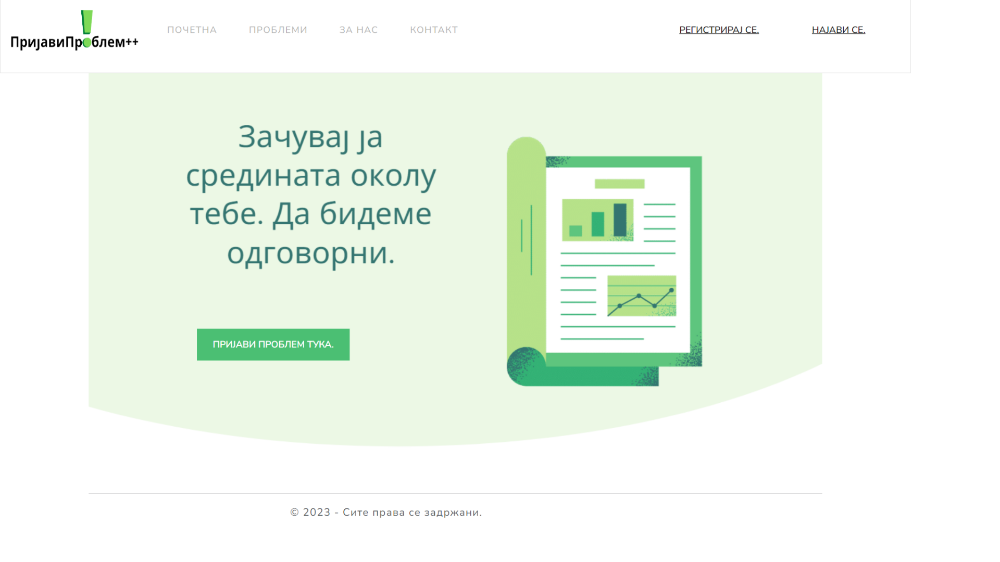 

Ненајавен корисник има само преглед на веќе пријавени проблеми.

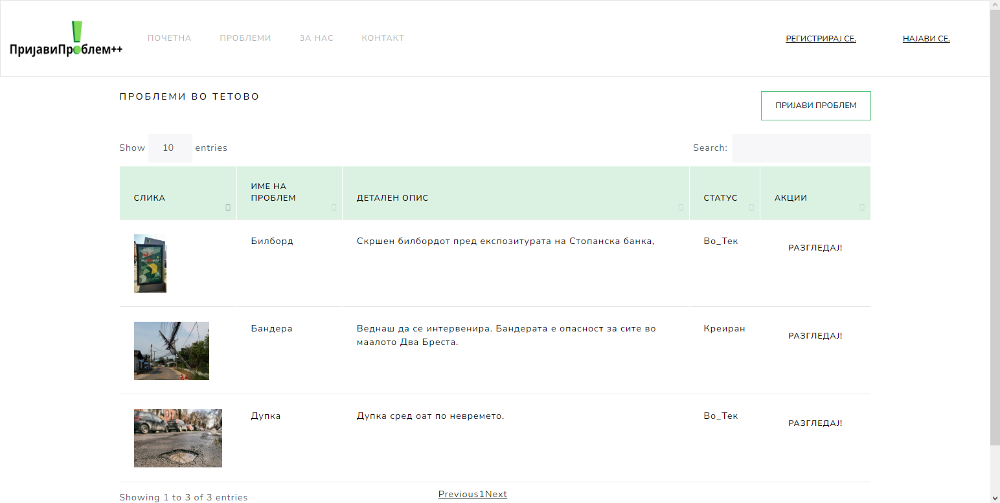 

Доколку сака да пријави проблем, истото може да го направи со клик на копчето *Пријави проблем*. Ако не е најавен, при клик се отвора страницата за најава. Ако станува збор за нерегистриран корисник, може да се регистрира со клик на линкот *Немате профил? Регистрирајте се тука.* или преку клик на линкот *Регистрирај се* во горниот десен агол. 

### User

Еден најавен корисник може да разгледува веќе пријавени прблеми и да пријави.

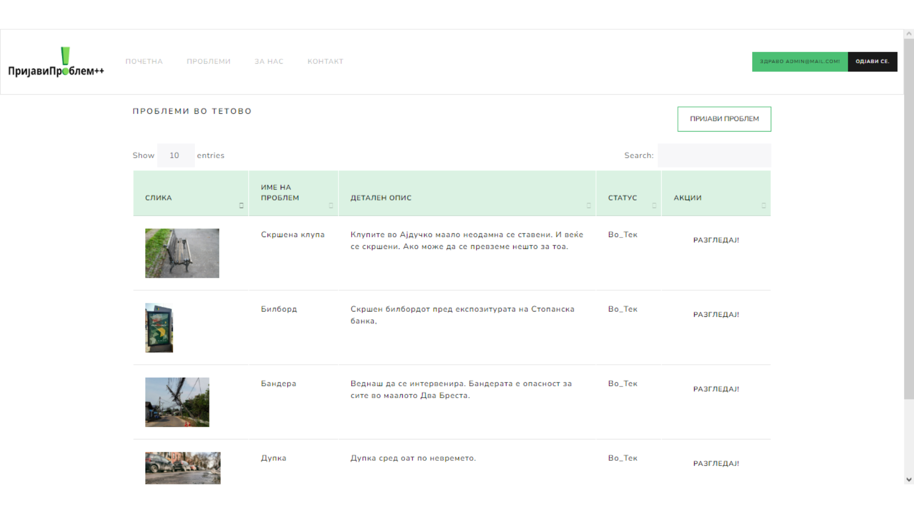 
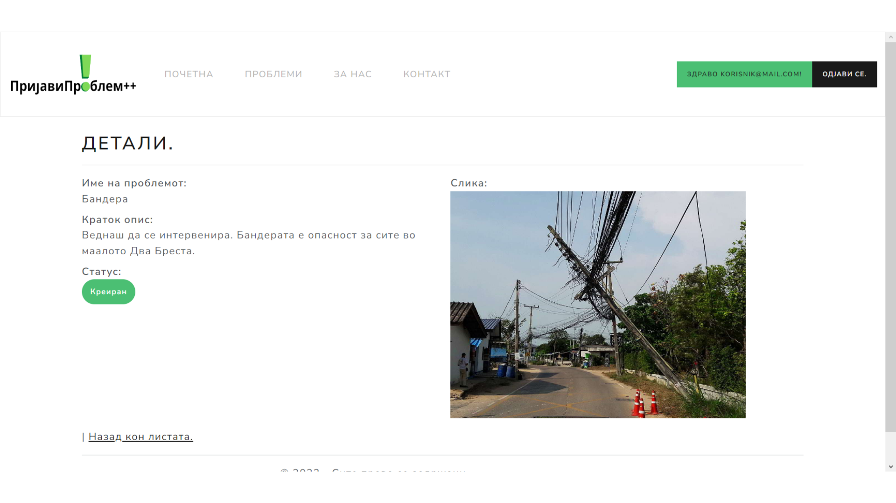 

За да пријави проблем, треба да внесе податоци за истиот: *име, опис, слика*.
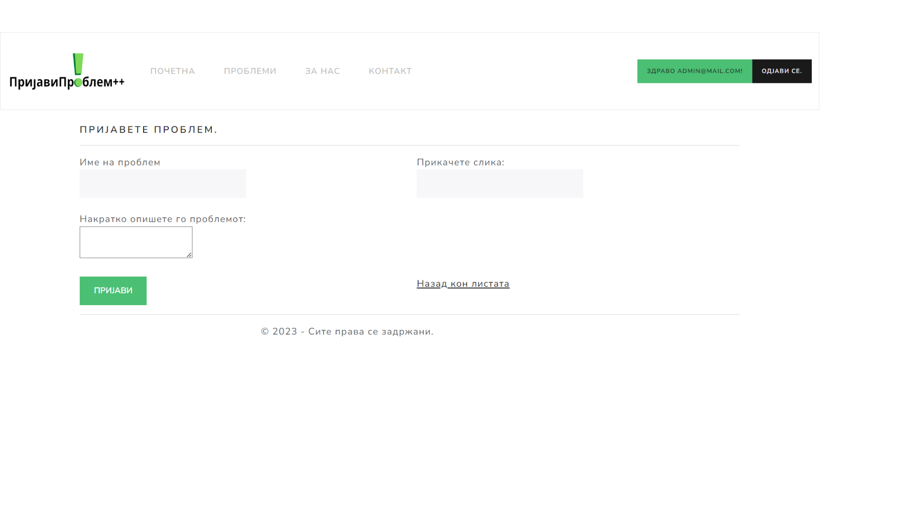 

### Admin

Како администратор на апликацијата, освен основните можности, овозможено е управување со пријавени проблеми (CRUD операции):
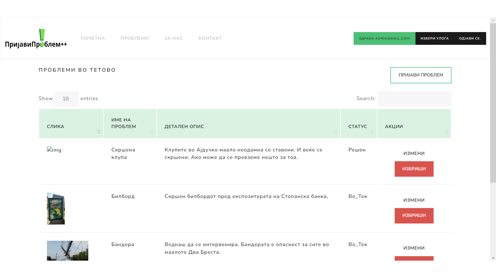

Измени:
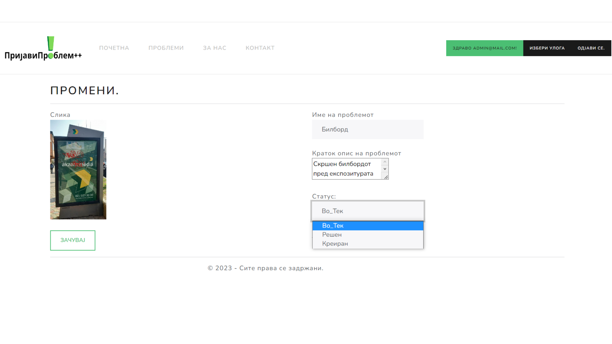

Избриши:
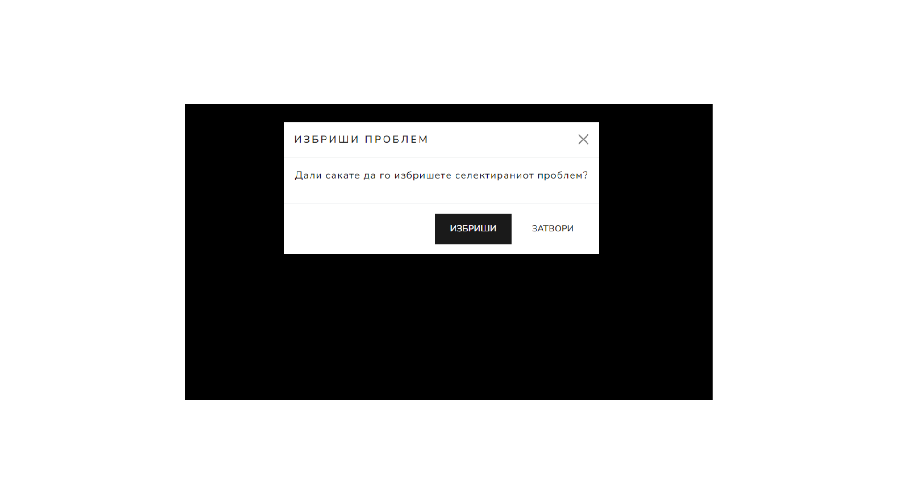

И доделување улоги на регистрирани корисници со клик на копчето *Избери улога* во горниот десен агол.
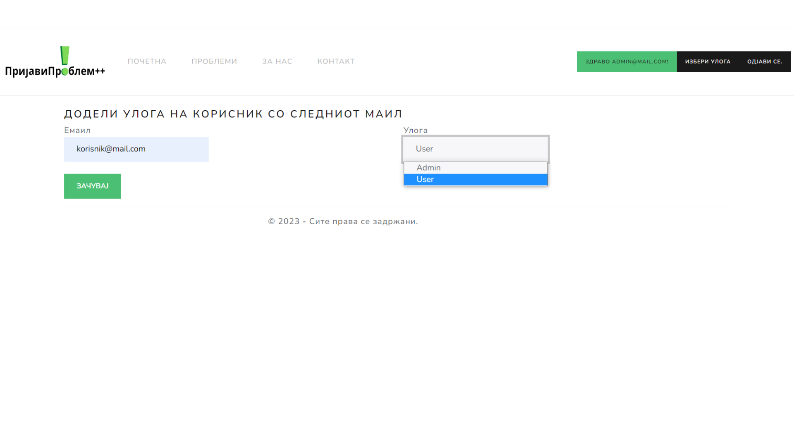 

Во навигациското мени има и два линка: 
#### За нас
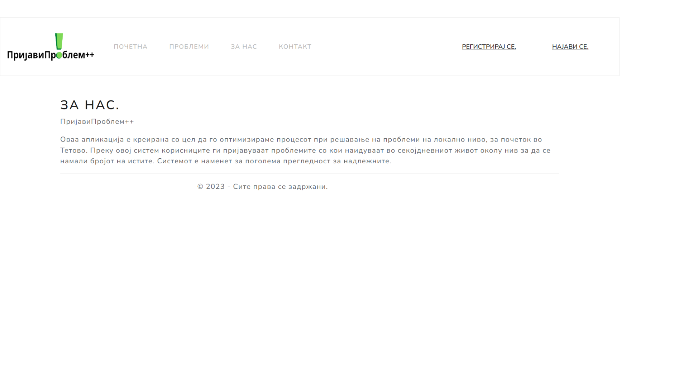 

#### Контакт
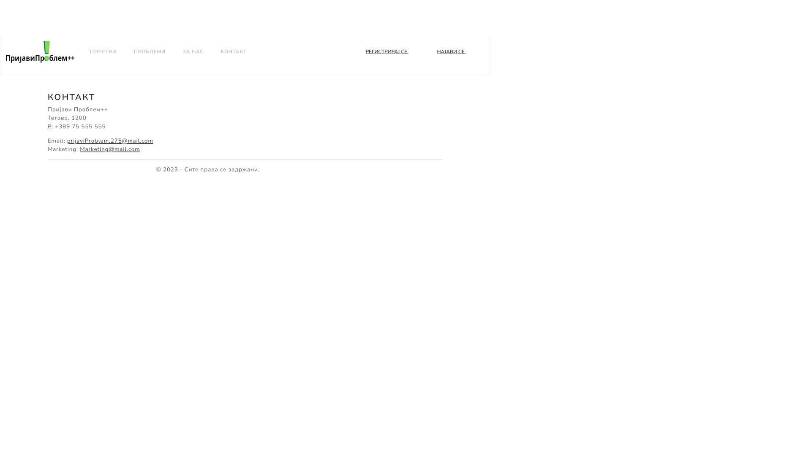 

